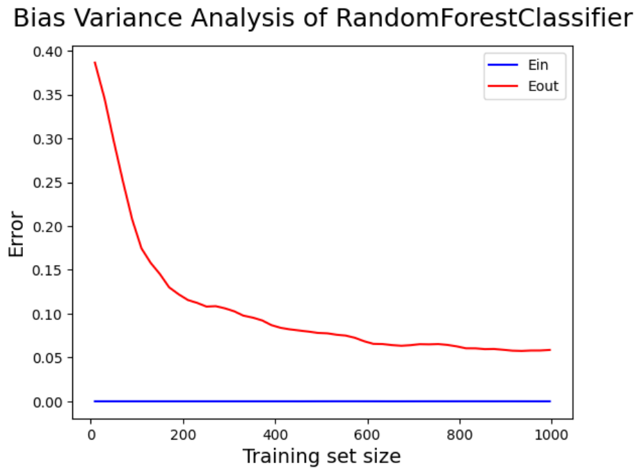

<h1 align="center">Human-Body-Level-Classifier</h1>

# Table of Contents
1. [Introduction to the Problem](#introduction-to-the-problem)
2. [Dataset Analysis & Preprocessing](#dataset-analysis--preprocessing)
3. [Feature Engineering](#feature-engineering)
4. [Machine Learning Models](#machine-learning-models)
    - [Baseline Models](#baseline-models)
    - [Logistic Regression](#logistic-regression)
    - [SVM](#svm)
    - [Decision Tree](#decision-tree)
    - [Random Forest](#random-forest)
5. [Models' Comparison](#models-comparison)


# Introduction to the Problem
The main goal of the project is to solve the supervised problem of body level classification. Given numerical and categorical features of a person's health such as  height, and weight, family history, the goal is to predict the body level of the person out of four levels.

# Dataset Analysis & Preprocessing
The provided dataset is initially split into train and test with ratios of 0.75 & 0.25 respectively. This is done to ensure that the generalization ability of the implemented models is a good approximation to its generalization ability on the real test set then the following analysis is done on the training dataset. The following plots show that there is a target class imbalance in the training dataset.


All the continuous attributes are standardized (normalized) using
StandardScaler().

The categorical attributes’ details are shown in the following table.


Those attributes can be classified and represented as follows
according to the four levels of data.


# Feature Engineering

The following plot shows the covariance matrix between all continuous features (after standardization) and the target label (Body_Level)


Outlier analysis was performed based on the interquartile distance of each continuous variable. An attribute value (x) is considered to be an outlier if one of the following conditions is satisfied:
- x > Q3 + 3 * IQD
- x < Q1 - 3 * IQD

The analysis results are shown in the following table:


From the previous analysis results, we can conclude that the ‘Meal_Count’ attribute has many outlier values and it has a very low correlation with the target variable. So, this attribute was removed from the dataset to not affect the results of the classification task.


# Machine Learning Models

## Baseline Models
Three baseline models are implemented which are:
1. Most frequent (ZeroR): It always returns the most frequent class label in the training data.
2. Uniform: It generates predictions uniformly at random from the list of unique classes observed in training data, i.e. each class has equal probability.
3. Constant: It always predicts a constant label that is provided by the user. This is useful for metrics that evaluate a non-majority class

The following figure shows the results of the three baseline models:


## Logistic Regression

#### Parameter Tuning
In the Logistic Regression model, several hyperparameters can be tuned. The penalty, C, and solver parameters are tuned.
- Penalty: determines the type of regularization to be used in the logistic regression model (L1 / L2)
- C: controls the strength of the regularization in the model. A smaller value of C results in stronger regularization
- Solver: determines the algorithm to be used for optimization in the logistic regression model

After using GridSearchCV and passing to it all possible values for parameters it selected the following best parameters 
```json
{
    "C": 100,
    "penalty": "l2", 
    "solver": "lbfgs"
}
```
Best accuracy score: 0.9882563161716929


#### Learning Analysis


This curve shows how the performance of a model improves with increasing amount of training data.
As can be seen, the training and validation scores are converging at high values as the number of training examples increases and that means the model neither overfits nor underfitting the data, and it generalizes well to unseen data.


#### Bias-Variance Analysis


Conclusions:
- It is a complex model, as Eout changes rapidly and the final Eout is small
- Eout decreases as the variance decreases and Ein increases as it becomes harder to fit the data points
- Eout starts much higher for the complex model as the number of points is initially too small and thus large variance
- Ein and Eout become the same as N tends to infinity due to Hoeffding’s inequality


#### Model Evaluation


## SVM

#### Parameter Tuning
We used manual parameter tuning by setting the kernel to poly and trying values for the degree from 1 to 20. The results are shown in the following figure.


This plot can be interpreted as follows:
- The first part of the plot (degree ∈ [1,5]): The complexity of the model increases, the in-sample error (Ein) decreases while the out-of-sample error (Eout) increases. This means that the model is overfitting the data by definition of overfitting.
- The second part of the plot (degree ∈ [6,20]): The complexity of the model increases, the in-sample error (Ein) increases and the out-of-sample error (Eout) increases. This means that there is no overfitting, however Eout is large (bad generalization ability).

The previous analysis shows that a polynomial kernel is not appropiate in this case (it results in either overfitting or bad generalization), for this reason the GridSearchCV is used to determine what are the best values for most of the parameters:
- C: Controls the tradeoff between maximizing the margin and minimizing the classification error. A higher value of C means the classifier will prioritize classification accuracy over the margin width
- Kernel: Transform the input data into a higher-dimensional feature space where a linear boundary can be used to separate the data.
- Gamma: It controls the shape of the decision boundary and how tightly the algorithm fits the data. A small gamma value means the decision boundary is relatively smooth
- Degree: This parameter determines the degree of the polynomial function used in the polynomial kernel

The resulting best parameters:
```json
{
    "kernel": "linear", 
    "degree": 1, 
    "gamma": 1, 
    "C": 10
}
```
However the degree parameter is useless in this case because the kernel is linear.

#### Learning Analysis


This curve shows how the performance of a model improves with increasing amounts of training data. As can be seen the training and validation scores are converging at high values as the number of training examples increases and that means the model neither overfits nor underfitting the data, and it generalizes well to unseen data.

#### Bias-Variance Analysis


Conclusions:
- It is a complex model, as Eout changes rapidly and the final Eout is small
- Eout decreases as the variance decreases and Ein increases as it becomes harder to fit the points
- Eout starts much higher for the complex model as the number of points is initially too small and thus large variance
- Ein and Eout become the same as N tends to infinity due to Hoeffding’s inequality

#### Model Evaluation


## Decision Tree

#### Parameter Tuning
In decision tree algorithms, the depth parameter controls the maximum depth or level of the tree that is allowed during the learning process. The depth of a tree refers to the length of the longest path from the root node to any leaf node in the tree. Setting a maximum depth limit on a decision tree can be useful in preventing overfitting, but it is important to find the optimal balance between overfitting and underfitting through model selection techniques.

Evaluating the decision tree for each depth in the range from 1 to 200:


This plot can be interpreted as follows:
- By increasing the decision tree depth the in-sample and out-sample error decreased which indicates that the model can learn and generalize well to new, unseen data. However, it is important to strike a balance between overfitting and underfitting, as overly complex models can lead to overfitting and poor generalization performance.
- We can observe that the in-sample and out-sample error saturated after depth almost equal to 25.
- Therefore, we selected our maximum depth parameter with value equals 25.


#### Bias-Variance Analysis


Conclusions:
- The model is complex.
- Eout starts at the high point as the number of points initially is too small and thus the variance is too large.
- Ein starts at a low point as the complex model can easily find a hypothesis that fits the small sample.
- Eout and Ein become the same as N → ∞ which is true by Hoeffding’s inequality.
- The final Eout is very small as N → ∞ and var → 0 and Eout includes only the bias.

#### Model Evaluation


## Random Forest

#### Parameter Tuning
The number of estimators (n_estimators) is a hyperparameter in random forest that controls the number of decision trees built during training. Increasing n_estimators can improve the accuracy of the model up to a certain point, but setting it too high can lead to overfitting. The optimal value of n_estimators depends on the problem complexity, dataset size, and computational resources available.

Evaluating the random forest for each value of n_estimators in the range from 1 to 200:


Conclusions:
- By increasing the value of n_estimators, the out-of-sample error decreases but from the figure it almost saturates after n_estimators = 25

Using grid search, the best value of n_estimators is 100.


#### Bias-Variance Analysis



Conclusions:
- The model is complex.
- Eout starts at the high point as the number of points initially is too small and thus the variance is too large.
- Ein starts at a low point as the complex model can easily find a hypothesis that fits the small sample.
- Eout and Ein become the same as N → ∞ which is true by Hoeffding’s inequality.
- The final Eout is very low as N → ∞ and var → 0 and Eout includes only the bias.

#### Model Evaluation


## Models' Comparison


The SVM model scored 96.9% weighted F1-score in the competition of the project.
